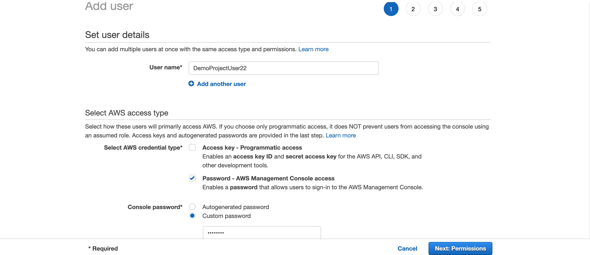
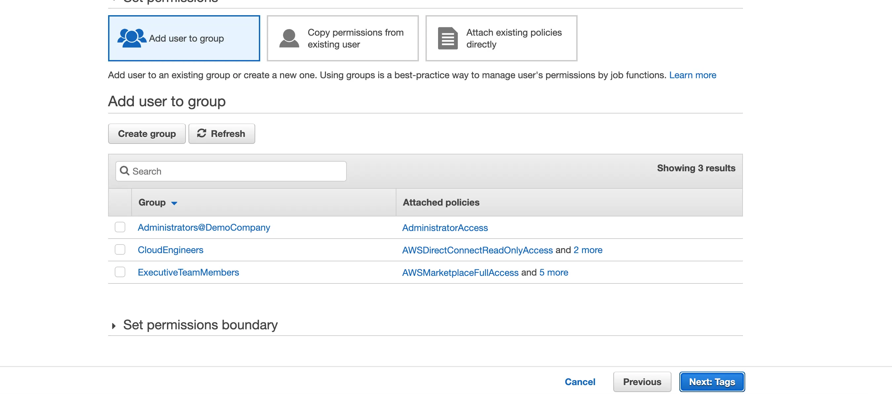
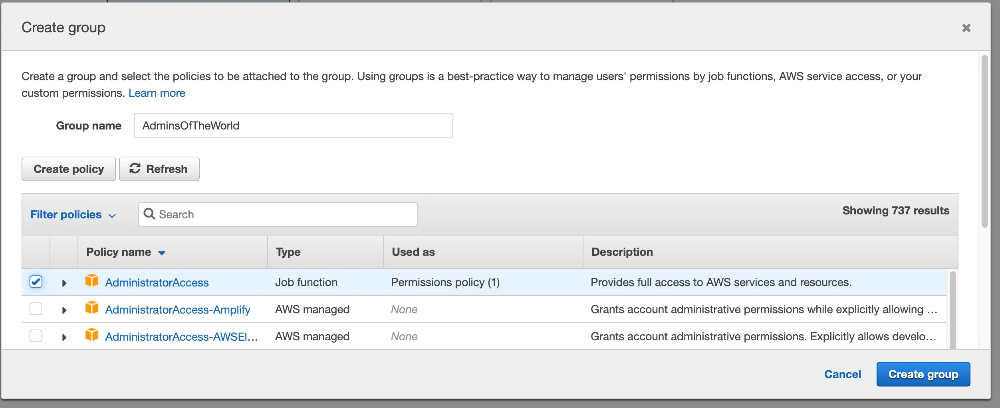
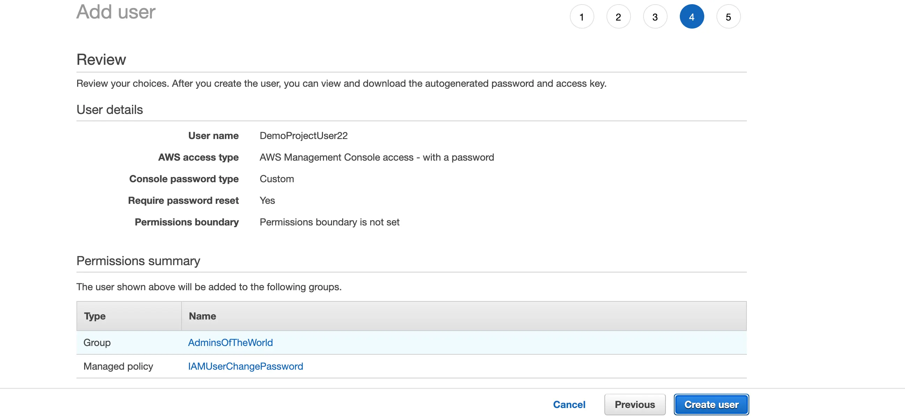
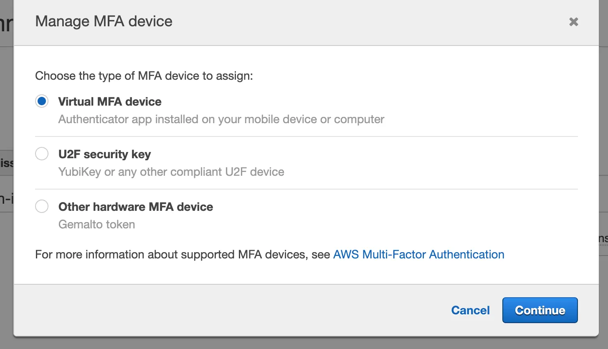
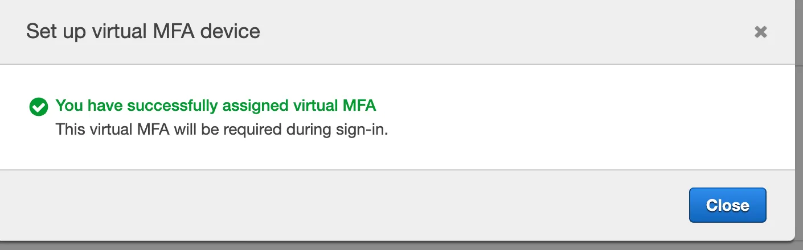
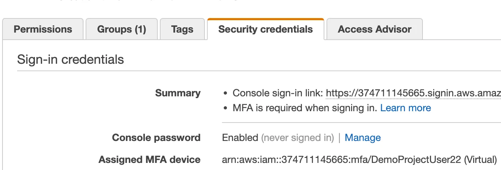
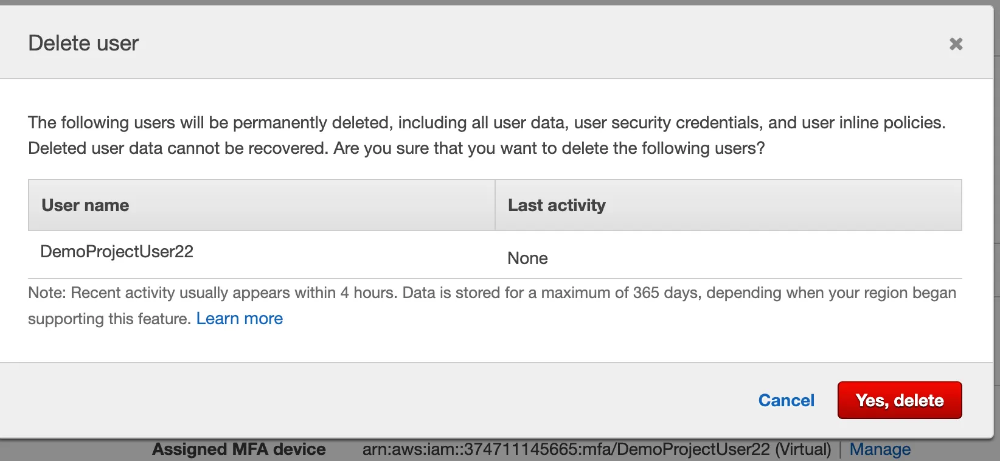

# AWS-IAM-MFA-Setup-Project

# Creating a IAM User, Creating a User Group, Assigning a Permission to a User and Setting Up MFA.

Hello all and welcome to my project. In this project I will be showing you how to create a IAM User, create a user group to add a user into it, as well as assigning special permissions for a user.

# What is an IAM User??

“AWS Identity and Access Management (IAM) is a web service for securely controlling access to AWS services. With IAM, you can centrally manage users, security credentials such as access keys, and permissions that control which AWS resources users and applications can access”.

# What you will need:
1) A AWS account(New users will be eligible for the 1 year AWS Free Tier).
  
2) A working PC/Laptop. MacOS/Windows
   
3) Sign into your AWS account. Upon successfully logging into your AWS account, you will be greeted with the AWS Management Console Home. Type “IAM” in the search box and click on “IAM”.
   

5) You will be greeted with the “Add User” page. The first thing you must do is to choose a username for your user. For the sake of this project, I use the name “DemoProjectUser22”. It is up to you as the root user to choose a name that appropriately helps you properly “MANAGE” and “IDENTIFY”your user(s).

After choosing a username thats fits your liking, you will have the option of choosing how the user will have access to the console. If you select “Access key — Programatic Access, this will require the user to enter a granted access key ID in order to use certain AWS services such as the command line(CL), API(Application Programming Interface), SDK(Software Development Kit).

The second option is to create a console password that you will enable your user(s) to be able to enter and have access to the console. For the sake of this project, I used the second option.

The user will have the ability to change their password upon their next sign-in, and this is strictly for security reasons.

6) Next up, we are going to create a “User group” to place our user(s) into. Click on “Add user to group”.

7) Enter a “Group name”. As you can see below in the image, I chose “AdminsOfTheWorld” as the group name.
We are going to give our group Administrator Access. Administrator Access provides unlimited access with no restrictions to AWS services and resources. Select “AdministratorAccess” and click on “Create group”.

8) Verify here on the review page that everything is setup to your liking before the user and group is officially created. When you are satisfied with how everything is setup, click on “Create user”.

9) Finally… Congratulations you have successfully created your user and group!

10) Now that the user and group have been officially created, it is time to setup Multi Factor Authentication(MFA) for the user. Multi Factor Authentication is another layer of security that further helps users ensure that their account is protected. MFA comes in a variety of different methods, including a virtual MFA device that can be installed on an app on a phone(Ex: Microsoft Authenticator), a U2F security key, and a hardware-based MFA device.

11) Under Security credentials where is says “Assigned MFA device”, click on “Manage”

We will be using a virtual MFA device for this project. I used Microsoft Authenticator as the “Manage MFA device”.

12) Due to security reasons I will not be showing the MFA access codes. Upon entering the MFA code you should get the same successful message. The user now has the peace of mind of knowing that their account is more secured with MFA setup.
   

Congratulations! You have successfully created a IAM user, User group, as well as setup a MFA for your user. Do not forgot to delete your user if you don’t want them having long term access group access!

Thankyou
